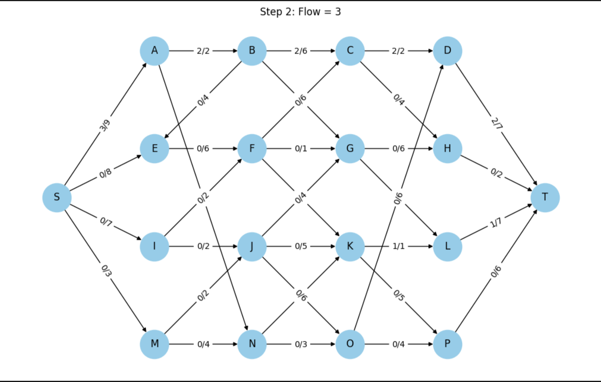
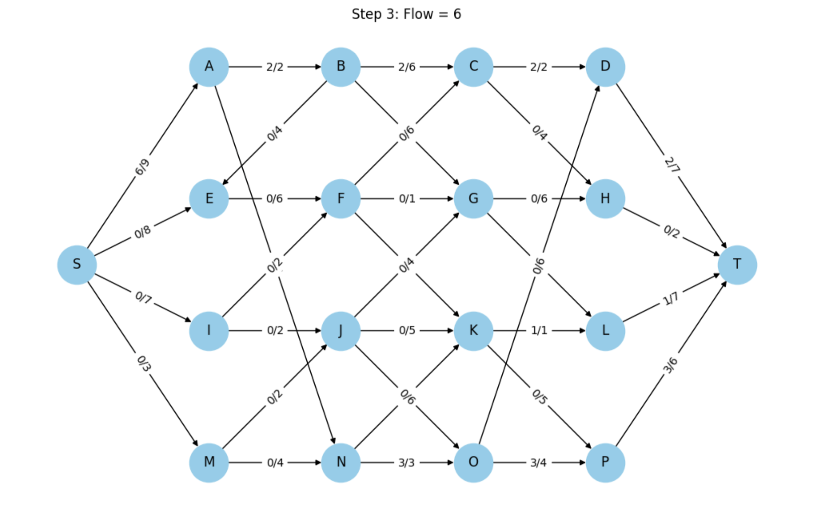
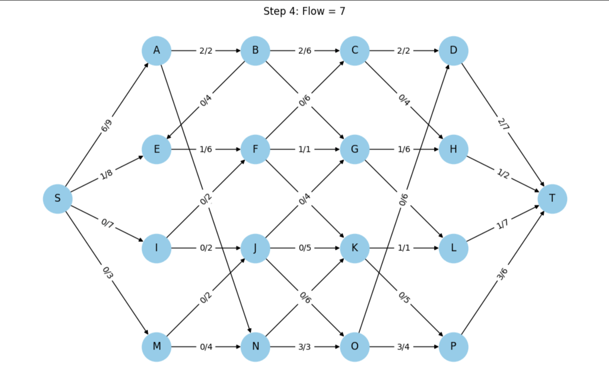
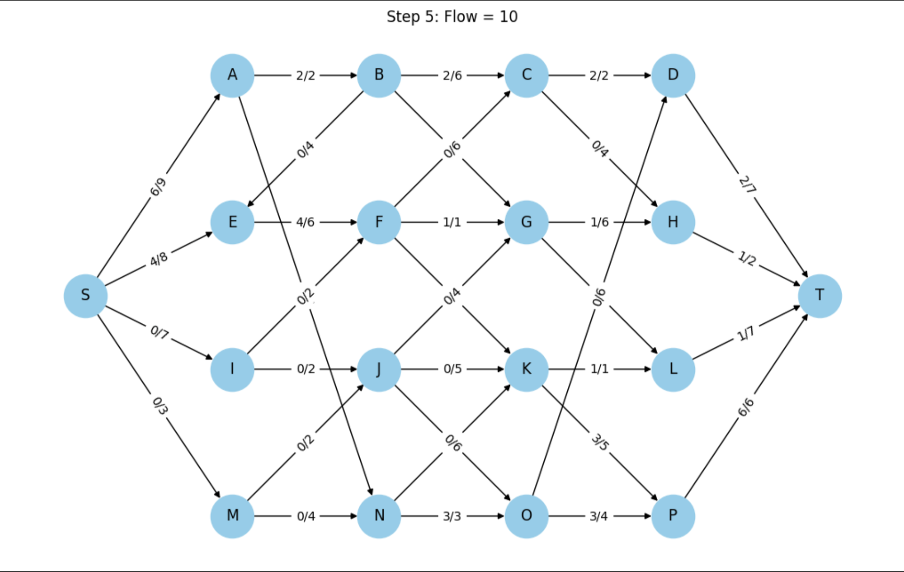
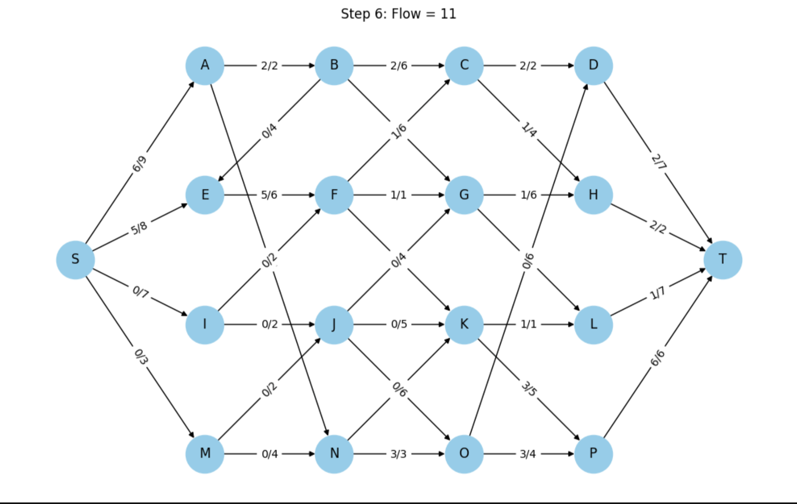
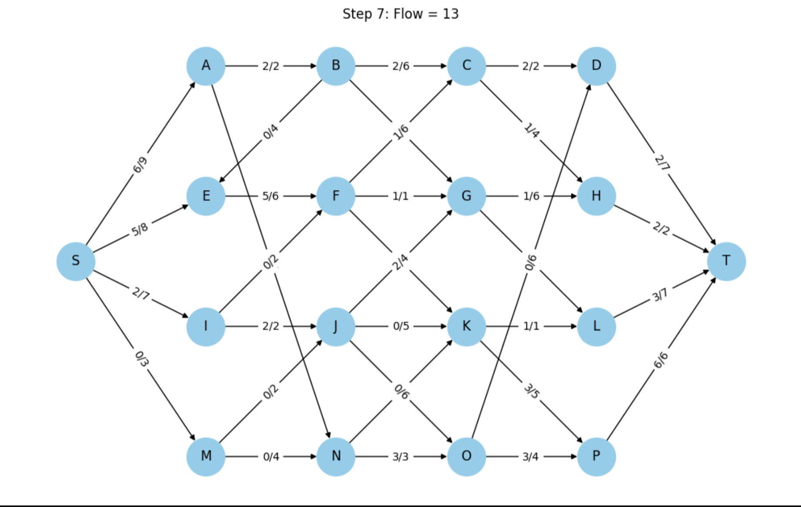
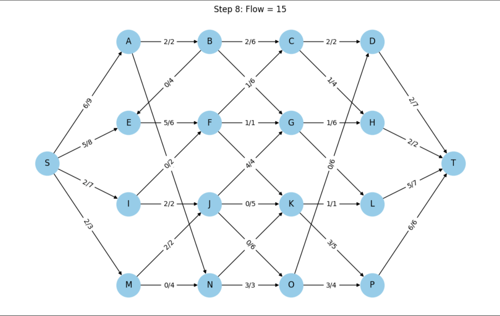
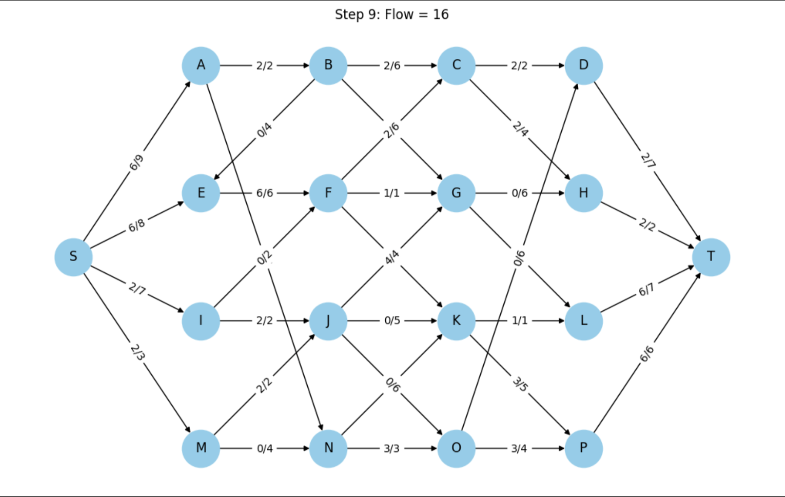
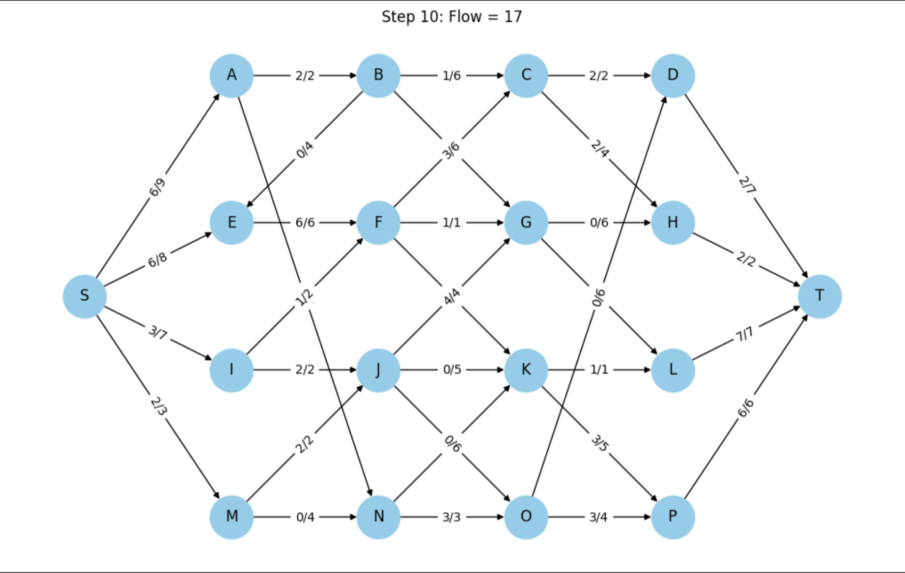
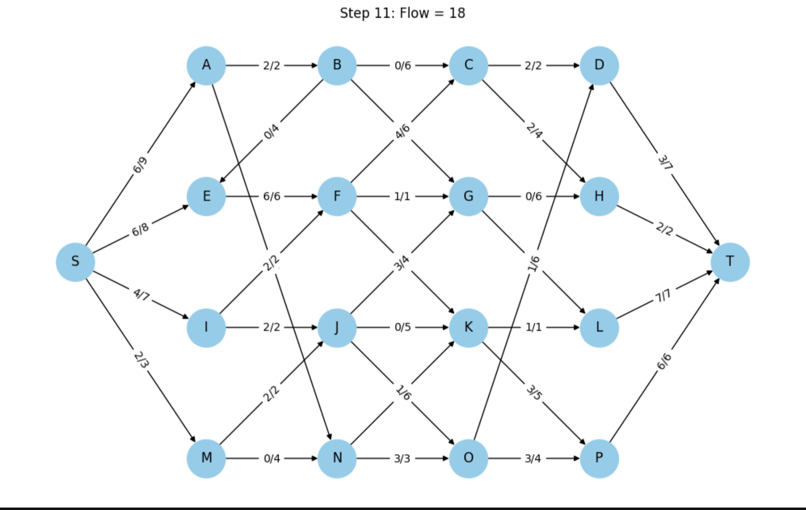

# Ford Fulkerson algorithm for graph 

### Initalising the graph 

Instead of computing the graph manually, I have used python to both visualise and compute the ford-fulkerson algorithm for the maximum flow of the graph defined in the coursework. 
To define the graph I have used a directed dictionary of edge lists as well as coordinate mappings from the networkx dependency from matplotlib to degine the structure and layout of the graph defined for the CW. 

```
graph = {
    'S': {'A': 9, 'E': 8, 'I': 7, 'M': 3},
    'A': {'B': 2, 'N': 6},
    'B': {'C': 6, 'G': 3, 'E': 4},
    'C': {'D': 2, 'H': 4},
    'D': {'T': 7},
    'E': {'F': 6},
    'F': {'G': 1, 'K': 3, 'C': 6},
    'G': {'H': 6, 'L': 8},
    'H': {'T': 2},
    'I': {'J': 2, 'F': 2},
    'J': {'K': 5, 'G': 4, 'O': 6},
    'K': {'L': 1, 'P': 5},
    'L': {'T': 7},
    'M': {'J': 2, 'N': 4},
    'N': {'K': 1, 'O': 3},
    'O': {'P': 4, 'D': 6},
    'P': {'T': 6},
    'T': {}
}

pos = {
    'S': (0, 1.5),
    'A': (1, 3), 'B': (2, 3), 'C': (3, 3),'D': (4, 3),
    'E': (1, 2), 'F': (2, 2), 'G': (3, 2), 'H': (4, 2),
    'I': (1, 1), 'J': (2, 1), 'K': (3, 1), 'L': (4, 1),
    'M': (1, 0), 'N': (2, 0), 'O': (3, 0), 'P': (4, 0),
    
    'T': (5, 1.5)
}
```

### Creating the algorithm

To create the algorithm I used the Ford-Fulkerson algorithm to compute the maximum flow of the network. 
To create arbitrary augmenting paths I implemented a standard BFS search, which is inspired by the code found here : https://www.geeksforgeeks.org/dsa/ford-fulkerson-algorithm-in-python/
This served as the base, which was modified to use a structured list called steps to help visualise the residual network and capacity constraint of the graph as the algorithm is implemented. 

```
def ford_fulkerson(graph, source, sink):
    max_flow = 0
    
    # Save initial state
    steps.append({
        'graph': copy.deepcopy(graph),
        'path': [],
        'flow': 0,
        'total_flow': 0
    })
    
    while True:
        parent = {}  # Reset parent for each BFS
        if not bfs_capacity_path(graph, source, sink, parent):
            break
            
        # Find bottleneck capacity
        path_flow = float('Inf')
        s = sink
        while s != source:
            path_flow = min(path_flow, graph[parent[s]][s])
            s = parent[s]
        
        # Reconstruct path for visualization
        path = []
        s = sink
        while s != source:
            path.append((parent[s], s))
            s = parent[s]
        path.reverse()
        
        # Update residual graph
        v = sink
        while v != source:
            u = parent[v]
            graph[u][v] -= path_flow
            if v not in graph:
                graph[v] = {}
            if u not in graph[v]:
                graph[v][u] = 0
            graph[v][u] += path_flow
            v = parent[v]
        
        max_flow += path_flow
        
        # Save step information
        steps.append({
            'graph': copy.deepcopy(graph),
            'path': path,
            'flow': path_flow,
            'total_flow': max_flow
        })
    
    return max_flow, steps'
```

### Visualising the algorithm 

To visualise the algorithm I used a design that implemented the global list of steps done by the FF algorithm to create a a comparison to the capacity to visualise the steps.

```
def draw_graph(graph, original_graph, pos, title="Flow Network"):
    G = nx.DiGraph()

    # Compute actual flow = original - residual
    for u in original_graph:
        for v, orig_cap in original_graph[u].items():
            res_cap = graph[u][v] if v in graph.get(u, {}) else 0
            flow = orig_cap - res_cap
            G.add_edge(u, v, flow=flow, capacity=orig_cap)

    plt.figure(figsize=(10, 6))
    nx.draw(G, pos, with_labels=True, node_color="skyblue", node_size=1200, arrows=True)

    # Show both flow and capacity as labels
    labels = { (u, v): f"{d['flow']}/{d['capacity']}" for u, v, d in G.edges(data=True) }
    nx.draw_networkx_edge_labels(G, pos, edge_labels=labels)

    plt.title(title)
    plt.show()

steps = []
source = 'S'
sink = 'T'

original_graph = copy.deepcopy(graph)
max_flow, steps = ford_fulkerson(copy.deepcopy(graph), source, sink)

for i, step_info in enumerate(steps):
    if i == 0:
        print("Initial Graph:")
    else:
        path_str = ' → '.join([u for u, v in step_info['path']] + [step_info['path'][-1][1]])
        print(f"\nStep {i}:")
        print(f"  Augmenting path: {path_str}")
        print(f"  Flow added: {step_info['flow']}")
        print(f"  Total flow so far: {step_info['total_flow']}")

    draw_graph(step_info['graph'], original_graph, pos, 
               title=f"Step {i}: Flow = {step_info['total_flow']}" if i > 0 else "Initial Graph")
```


## results: 

These are the results of the FF algorithm (computing an arbitrary augmenting path, computing the minimum capacity of the path and updating the network).

### Step 1 

`
Augmenting path: S → A → B → C → D → T
Flow added: 2
Total flow so far: 2
`
!([results_sc/step_1.png](https://github.com/Fred-MalloryBains/Graph_CW/blob/main/results_sc/step_1.png))

### Step 2

`
Augmenting path: S → A → N → K → L → T
Flow added: 1
Total flow so far: 3
`


### Step 3

`
Augmenting path: S → A → N → O → P → T
Flow added: 3
Total flow so far: 6
`


### Step 4 

`
Augmenting path: S → E → F → G → H → T
Flow added: 1
Total flow so far: 7
`


### Step 5 

`
Augmenting path: S → E → F → K → P → T
Flow added: 3
Total flow so far: 8
`


### Step 6 

`
Augmenting path: S → E → F → C → H → T
Flow added: 1
Total flow so far: 9
`


### Step 7 

`
Augmenting path: S → I → J → G → L → T
Flow added: 2
Total flow so far: 11
`



### Step 8 

`
Augmenting path: S → M → J → G → L → T
Flow added: 2
Total flow so far: 13
`


### Step 9 

`
 Augmenting path: S → E → F → C → H → G → L → T
Flow added: 1
Total flow so far: 14
`


### Step 10 

`
Augmenting path: S → I → F → C → B → G → L → T
Flow added: 1
Total flow so far: 15
`


### Step 11 

`
Augmenting path: S → I → F → C → B → G → J → O → D → T
  Flow added: 1
  Total flow so far: 16
`

